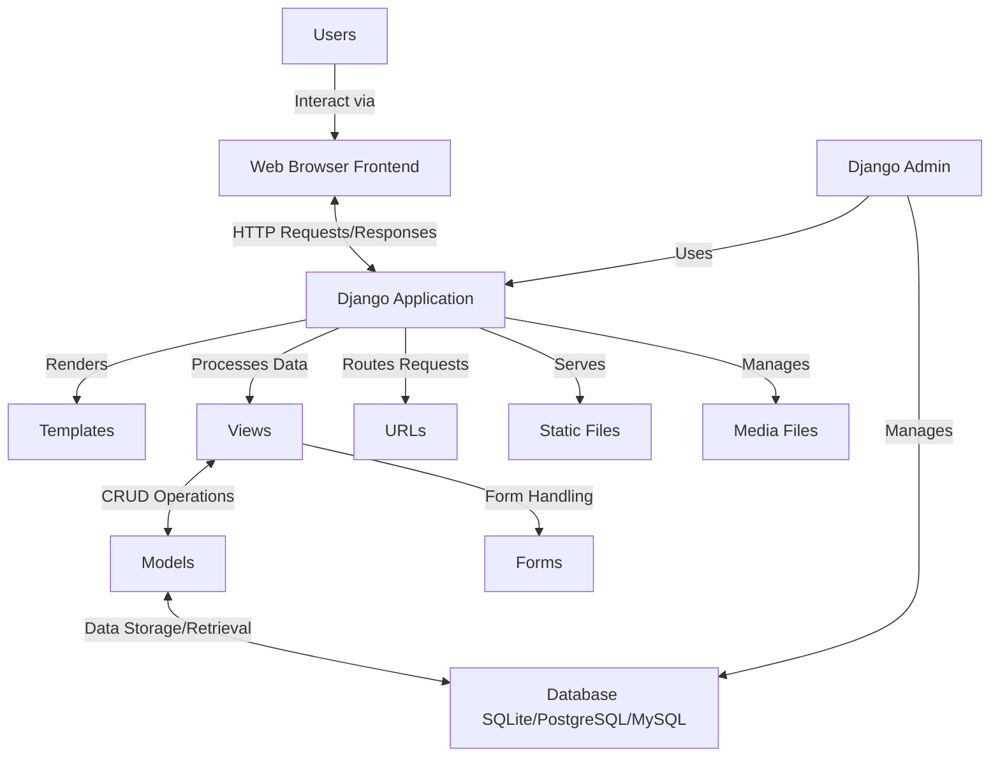

## Overview

The SMTP Mail project is a web-based email application developed using Django. It allows users to send, receive, and view emails. This project demonstrates basic web development skills, including form handling, state management, and email processing using Django.

## Architecture Design Diagram



This diagram illustrates the components and interactions within the SMTP Mail project:

- **Users** interact with the system through a web interface.
- **Web Browser / Frontend** sends requests to and receives responses from the Django application.
- **Django Application** contains:
    - **Views** handle HTTP requests and responses.
    - **Models** define the data schema for emails and user information.
    - **Forms** manage user input for sending and composing emails.
    - **URLs** route incoming requests to the appropriate views.
    - **Templates** render HTML responses.
- **Database** (SQLite/PostgreSQL/MySQL) stores user data and email information.
- **Static Files** (CSS, JavaScript, images) and **Media Files** (user-uploaded content) are served by the Django application.
- **Django Admin** provides an interface for administrators to manage users and emails.

This architecture ensures a clear separation of concerns and efficient data flow within the SMTP Mail project.

### 1. Working Application

Our application functions as intended and meets most of the requirements. We tested various scenarios to ensure performance.

### 2. Graphical User Interface (GUI)

We created an intuitive interface. The design aligns with modern web standards, allowing users to navigate and use email functions easily.

### 3. Architecture Design

We planned our architecture for clarity, as shown in our Design Diagram. Our system accommodates scalability and reliability for future growth.

### 4. Dockerization & Deployment

Our current setup uses a virtual environment for local deployment and testing. It works as DOcker alternative for python programs.

### 5. Approach and Problem-Solving

We structured our approach with clear separation of concerns in the Django application. Our documentation covers logic and implementation details. Our approach demonstrates understanding of web application development principles.

### Additional Notes

We used Git for version control and Whatsapp Group for team communication.

### Areas for Future Enhancement

We identified areas to improve our project:

- Implement Dockerization for large deployment (we used `venv` for this prototype project)
- Explore cloud deployment options
- Add advanced features like email attachments, filtering, and an address book

We aim to incorporate these enhancements in future iterations.

## Current Features

- **Compose Email**: Users can create and send new emails.
- **Inbox**: Users can view received emails.
- **Sent Mail**: Users can view emails they have sent.
- **Email Details**: Users can view the full content of an email.
- **User Authentication**: Users must log in to access their email account.

## Requirements

- Python 3.x
- Django
- HTML/CSS for frontend
- SQLite (or another database) for storing emails

## Installation Steps

1. **Clone the Repository and Navigate to `smtp` folder**
    
    ```bash
    git clone https://github.com/frankmathewsajan/MathClub_SMTP.git
    cd smtp
    ```
    
2. **Set Up Virtual Environment (Alternative to Dockerization)**
    
    ```bash
    python -m venv venv
    venv\Scripts\activate # On Linux use `source venv/bin/activate`
    ```
    
3. **Install Dependencies**
    
    ```bash
    pip install -r requirements.txt
    ```
    
4. **Set Up Database**
    
    ```bash
    python manage.py migrate
    ```
    
5. **Login** 
    
    You may use `frankmathewsajan@gmail.com` with password `1234567890` for login, or register a user yourself.
    
6. **Run the Application**
    
    ```python
    python manage.py runserver
    ```
    
    Access the application at `http://localhost:8000`
    

## Usage

### Compose Email

- Navigate to the "Compose" page.
- Enter the recipient's email address, subject, and message.
- Click "Send" to send the email.

### Inbox

- Navigate to the "Inbox" page.
- View the list of received emails.
- Click on an email to view its details.

### Sent Mail

- Navigate to the "Sent Mail" page.
- View the list of sent emails.
- Click on an email to view its details.

### Email Details

- Click on any email in the inbox or sent mail to view its full content, including sender, recipient, subject, and message.

## Code Structure

- **`manage.py`**: Django's command-line utility for administrative tasks.
- **`project3/`**: Directory containing Django project settings and configuration.
    - **`settings.py`**: Configuration settings for the Django project.
    - **`urls.py`**: URL declarations for the project.
    - **`wsgi.py`**: WSGI configuration for the project.
- **`mail/`**: Django app containing the core functionality.
    - **`models.py`**: Contains the data models for the application.
    - **`views.py`**: Contains the view functions that handle requests and responses.
    - **`forms.py`**: Defines forms used in the application.
    - **`templates/`**: Directory containing HTML templates for the frontend.
    - **`static/`**: Directory containing static files like CSS and JavaScript.

## Troubleshooting

- **Issue: Application not running**
    - Ensure that all dependencies are installed.
    - Check if the virtual environment is activated.
    - Verify that the Django development server is running without errors.
- **Issue: Database errors**
    - Ensure that the database is properly set up and migrated.
    - Check the configuration settings for database connection in `settings.py`.